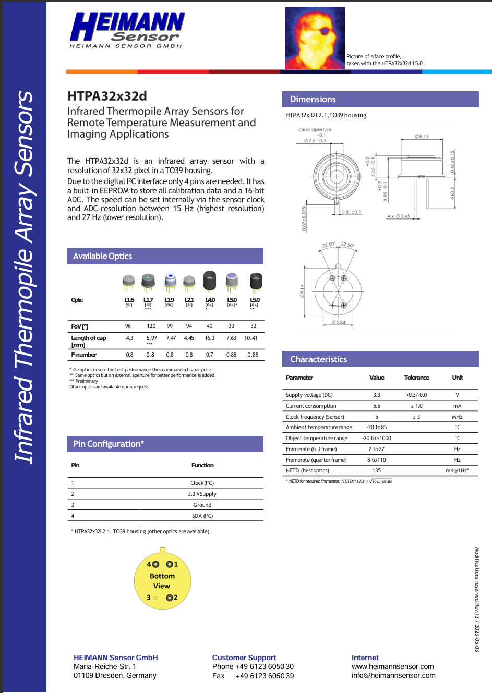

# Reffs

https://www.heimannsensor.com/32x32
https://github.com/HeimannSensor/ESP32_ApplicationShield/tree/main
https://www.raspberrypi.com/documentation/microcontrollers/silicon.html#why-is-the-chip-called-rp2040

